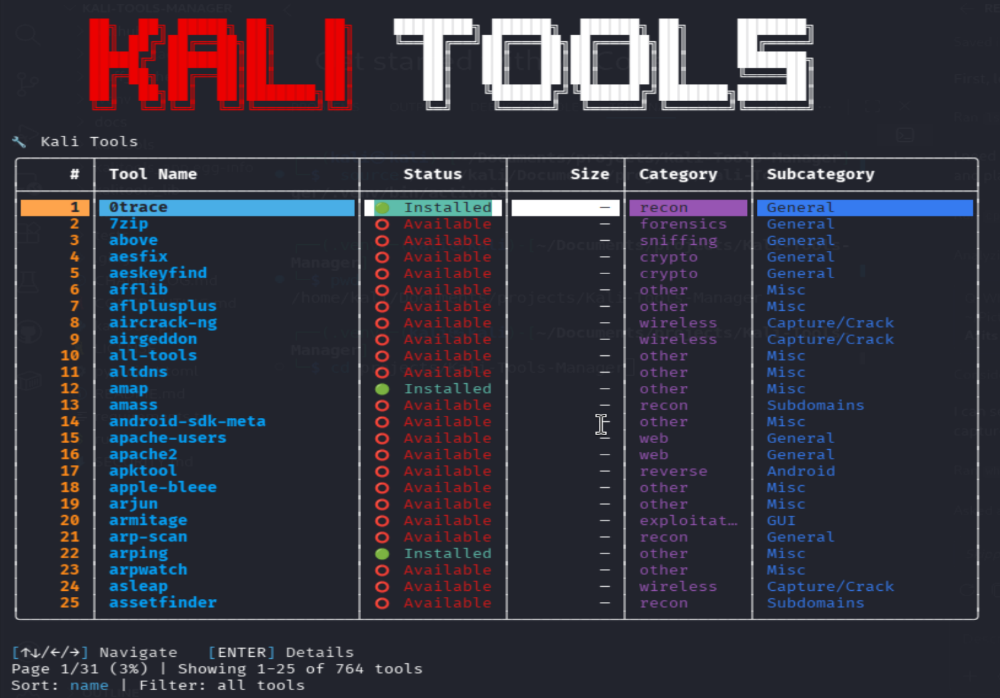

<h1 align="center">Kali Tools Manager</h1>

<p align="center">
  <b>Browse, install, and manage 700+ Kali Linux tools from a single terminal command.</b><br>
  Rich interactive CLI · Full-screen Textual TUI · Curated profiles · Offline support
</p>

<p align="center">
  
  
  
</p>

<p align="center">
  
</p>

---

## Features

- **700+ tools** cataloged from APT metadata and kali.org
- **Interactive Rich CLI** with keyboard navigation, search, and category browsing
- **Full-screen Textual TUI** with category sidebar, tool table, detail panel, and in-app install modal
- **Cyber progress bar** — animated Knight Rider-style scanner during installs
- **Curated profiles** — one-command setup for pentesting, forensics, OSINT, bug bounty, and CTF
- **Install / uninstall** with sudo elevation, dependency display, disk-space checks, and desktop notifications
- **Export / import** your installed toolset as JSON or an idempotent bash script
- **Offline mode** — route APT through a local mirror on air-gapped hosts
- **History tracking** — every install, remove, and launch is recorded in a local SQLite database
- **Star favourites** — bookmark the tools you use most

---

## Requirements

| Requirement | Details |
|---|---|
| **OS** | Kali Linux or any Debian-based security distribution |
| **Python** | 3.10 or newer |
| **Package manager** | `apt-get` (comes with Kali/Debian) |

---

## Quick Start

```bash
# 1. Clone the repo
git clone https://github.com/MushroomCyber/Kali-Tools-Manager.git
cd Kali-Tools-Manager

# 2. Run (auto-creates venv and installs deps)
chmod +x run.sh
./run.sh            # interactive Rich CLI
./run.sh --tui      # full-screen Textual TUI
```

`run.sh` handles virtual environment creation and dependency installation automatically.

---

## Installation

### Option A: pipx (recommended)

```bash
pipx install '.[notifications,disk,tui,fuzzy]'
```

### Option B: pip + venv

```bash
python3 -m venv .venv
source .venv/bin/activate
pip install -r requirements.txt
pip install .
```

### Optional extras

| Extra | What it adds |
|---|---|
| `notifications` | Desktop toast alerts on install/uninstall |
| `disk` | Free-disk-space check before installs |
| `tui` | Full-screen Textual TUI (`--tui`) |
| `fuzzy` | Fuzzy search matching |

---

## Usage

### Launch

```bash
kalitools                    # interactive Rich CLI (default)
kalitools --tui              # full-screen Textual TUI
./run.sh                     # auto-setup launcher
```

### Browse & Search

```bash
kalitools list                          # list all tools
kalitools list --installed              # only installed tools
kalitools list --category web           # filter by category
kalitools search nmap                   # search by name
kalitools show hydra                    # detailed tool info
```

### Install & Remove

```bash
kalitools install nmap                  # install with progress bar
kalitools install nmap sqlmap burpsuite # install multiple at once
kalitools remove hydra --yes            # uninstall without confirmation
kalitools install nmap --dry-run        # preview without changes
```

### Profiles

Apply a curated bundle of tools with a single command:

```bash
kalitools profile list                  # see available profiles
kalitools profile show pentester-web    # preview what's included
kalitools profile apply bug-bounty      # install everything in the profile
```

| Profile | Audience | Packages |
|---|---|---|
| `pentester-web` | Web application testing | ~18 |
| `forensics-starter` | DFIR starter toolkit | ~15 |
| `osint-minimal` | Lightweight OSINT collection | ~12 |
| `bug-bounty` | Public bug-bounty recon & web | ~17 |
| `ctf-basics` | Jeopardy-style CTF starter | ~15 |

Create your own by dropping a JSON file in `~/.config/kalitools/profiles/`.

### Updates & Upgrades

```bash
kalitools update                        # apt-get update + list upgradable
kalitools upgrade                       # apt-get upgrade -y
kalitools catalog refresh               # rebuild the tool catalog
```

### History & Favourites

```bash
kalitools history                       # recent operations
kalitools history --package nmap        # filter by package
kalitools star nmap                     # bookmark a tool
kalitools list --starred                # list your favourites
```

### Export & Import

```bash
kalitools export --format json > tools.json       # save installed set
kalitools export --format script > install.sh     # idempotent bash script
```

### Version Pinning

```bash
kalitools hold nmap                     # pin current version (apt-mark hold)
kalitools unhold nmap                   # release pin
kalitools holds                         # list held packages
```

### System Diagnostics

```bash
kalitools doctor                        # check for common issues
```

---

## TUI Keyboard Shortcuts

| Key | Action |
|---|---|
| `/` | Focus search box |
| `i` | Install or remove the selected tool |
| `r` | Refresh the tool table |
| `q` | Quit |
| `↑` / `↓` | Navigate tools |
| `Enter` / `Esc` | Close install modal |

---

## Offline Mode

For air-gapped or restricted environments:

1. Configure a local APT mirror via the Utilities menu or point `~/.kali_tools_local_repo.txt` at your mirror path.

2. Set the environment variable:
   ```bash
   export KALITOOLS_OFFLINE=1
   ```

3. All installs and updates route exclusively through the local repository.

---

## Configuration

| Path | Purpose |
|---|---|
| `~/.config/kalitools/profiles/*.json` | Your custom profiles |
| `~/.local/state/kalitools/state.db` | Install state, history, stars (SQLite) |
| `~/.kali_tools_local_repo.txt` | Offline mirror path |
| `~/.kali_tools_overrides.json` | Category overrides |

| Environment Variable | Purpose |
|---|---|
| `KALITOOLS_OFFLINE` | Skip network requests, use local repo |
| `KALITOOLS_NO_EMOJI` | Strip emoji glyphs for minimal terminals |

See [docs/CONFIGURATION.md](docs/CONFIGURATION.md) for full details.

---

## Man Page

A full man page is included:

```bash
man -l man/kalitools.1
```

---

## Contributing

See [CONTRIBUTING.md](CONTRIBUTING.md) for guidelines.

---

## License

MIT. See [LICENSE](LICENSE).
