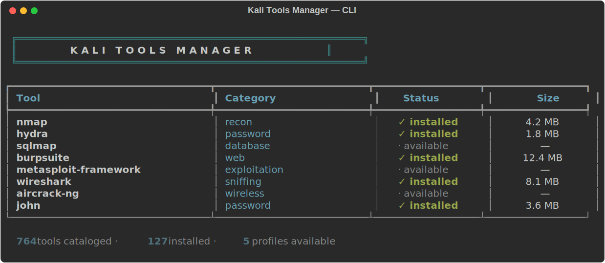
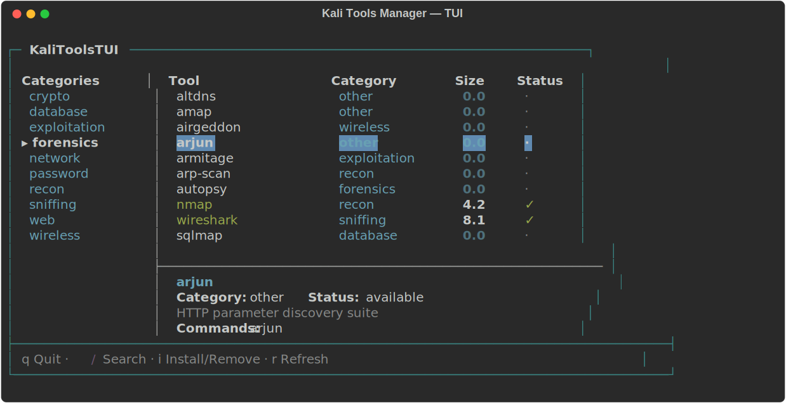
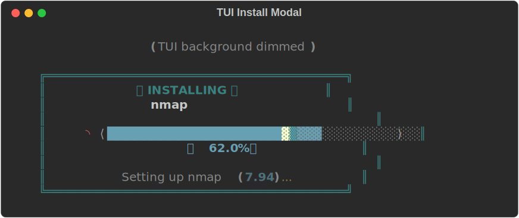

<p align="center">
  
</p>

<h1 align="center">Kali Tools Manager</h1>

<p align="center">
  <b>Browse, install, and manage 700+ Kali Linux tools from a single terminal command.</b><br>
  Rich interactive CLI · Full-screen Textual TUI · Curated profiles · Offline support
</p>

<p align="center">
  
  
  
  
</p>

---

## Features

- **700+ tools** cataloged from APT metadata and kali.org discovery
- **Interactive Rich CLI** with keyboard navigation, search, category browsing, and status widgets
- **Full-screen Textual TUI** with category sidebar, tool table, detail panel, and in-app install modal
- **Knight Rider cyber progress bar** — bouncing scanner animation during installs
- **Curated profiles** — one-command setup for pentesting, forensics, OSINT, bug bounty, and CTF workflows
- **Install / uninstall** with sudo verification, dependency display, disk-space checks, and desktop notifications
- **Export / import** tooling lists as JSON or idempotent bash scripts
- **Offline mode** — route APT through a local mirror on air-gapped hosts (`KALITOOLS_OFFLINE=1`)
- **SQLite state database** — install history, starred tools, and launch tracking survive catalog rebuilds
- **`robots.txt` compliant** web scraping with exponential backoff and circuit breaker
- **33 tests** covering core logic, security regexes, profiles, state DB, config, themes, and CLI smoke tests

---

## Screenshots

### Full-Screen TUI

<p align="center">
  
</p>

### In-App Install Modal (TUI)

<p align="center">
  
</p>

### Cyber Progress Bar (CLI)

<p align="center">
  
</p>

---

## Requirements

| Requirement | Details |
|---|---|
| **OS** | Kali Linux or any Debian-based security distribution |
| **Python** | 3.10 or newer |
| **Package manager** | `apt-get` (comes with Kali/Debian) |

---

## Quick Start

```bash
# 1. Clone the repo
git clone https://github.com/MushroomCyber/Kali-Tools-Manager.git
cd Kali-Tools-Manager

# 2. Run (auto-creates venv and installs deps)
chmod +x run.sh
./run.sh            # interactive Rich CLI
./run.sh --tui      # full-screen Textual TUI
```

That's it. `run.sh` handles virtual environment creation and dependency installation automatically.

---

## Manual Installation

### Option A: pipx (recommended for daily use)

```bash
pipx install '.[notifications,disk,tui,fuzzy]'
kalitools              # Rich CLI
kalitools --tui        # Textual TUI
```

### Option B: venv (for development)

```bash
python3 -m venv .venv
source .venv/bin/activate
pip install -e '.[notifications,disk,tui,fuzzy,dev]'
```

### Option C: requirements.txt

```bash
python3 -m venv .venv
source .venv/bin/activate
pip install -r requirements.txt
pip install -e .
```

### Optional extras

| Extra | Installs | Purpose |
|---|---|---|
| `notifications` | `notify2` | Desktop toast notifications on install/uninstall |
| `disk` | `psutil` | Free-disk-space pre-check before installs |
| `tui` | `textual` | Full-screen Textual TUI |
| `fuzzy` | `rapidfuzz` | Fuzzy search matching |
| `dev` | `pytest`, `ruff`, … | Test and lint tooling for contributors |

---

## Usage

### Launch

```bash
kalitools                    # interactive Rich CLI (default)
kalitools --tui              # full-screen Textual TUI
python -m kalitools          # module invocation
python kalitools.py          # legacy launcher
./run.sh                     # auto-setup launcher
```

### Subcommands

```bash
# Browse & search
kalitools list                          # list all tools
kalitools list --installed --json       # installed tools as JSON
kalitools search nmap                   # search by name
kalitools show hydra                    # detailed tool info

# Install & remove
kalitools install nmap                  # install with progress bar
kalitools remove hydra --yes            # uninstall without confirmation
kalitools install nmap --dry-run        # preview without changes

# Profiles (curated tool bundles)
kalitools profile list                  # list available profiles
kalitools profile show pentester-web    # preview a profile
kalitools profile apply bug-bounty      # install all tools in profile

# Catalog management
kalitools catalog refresh               # rebuild from APT metadata
kalitools catalog info                  # catalog statistics

# History
kalitools history                       # recent operations
kalitools history --package nmap        # filter by package
kalitools history --clear               # wipe history

# Export / import
kalitools export --format json > tools.json
kalitools export --format script > install.sh
```

### TUI Keyboard Shortcuts

| Key | Action |
|---|---|
| `/` | Focus search box |
| `i` | Install or remove the selected tool |
| `r` | Refresh the tool table |
| `q` | Quit |
| `↑` / `↓` | Navigate tools |
| `Enter` / `Esc` | Close install modal |

---

## Profiles

Five curated profiles ship out of the box:

| Profile | Audience | Packages |
|---|---|---|
| `pentester-web` | Web application testing | ~18 |
| `forensics-starter` | DFIR starter toolkit | ~15 |
| `osint-minimal` | Lightweight OSINT collection | ~12 |
| `bug-bounty` | Public bug-bounty recon & web | ~17 |
| `ctf-basics` | Jeopardy-style CTF starter | ~15 |

Create your own by dropping a JSON file in `~/.config/kalitools/profiles/`.

See [docs/PROFILES.md](docs/PROFILES.md) for the full profile specification.

---

## Offline Mode

For air-gapped or restricted environments:

1. Configure a local APT mirror:
   ```bash
   kalitools catalog refresh  # or via the Utilities menu
   ```
   Point it at a USB drive or local mirror directory.

2. Set the environment variable:
   ```bash
   export KALITOOLS_OFFLINE=1
   ```

3. Installs and updates will route exclusively through the local repository.

---

## Project Layout

```
kalitools.py                 # convenience launcher
run.sh                       # one-command auto-setup launcher
kalitools/                   # main package
  __init__.py                # shared console/logger
  __main__.py                # python -m kalitools
  cli.py                     # argparse wiring + entry points
  manager.py                 # core business logic + cyber progress bar
  ui.py                      # Rich interactive TUI
  config.py                  # export/import helpers
  constants.py               # categories, icons, keyword hints
  model.py                   # Tool data model
  state.py                   # SQLite state database
  profiles.py                # profile loader
  history.py                 # operation history
  theme.py                   # Rich theme registry
  doctor.py                  # system health checks
  http_util.py               # robots.txt-aware HTTP client
  notifications.py           # desktop notifications
  apt_catalog.py             # APT-first catalog builder
  data/                      # shipped catalog + bundled profiles
    tools_merged.json        # 700+ tool entries
    profiles/                # 5 curated profiles
  tui/                       # Textual TUI
    app.py                   # full-screen app + install modal
kalitools_lib/               # stand-alone scraping helpers
tests/                       # 33 tests
docs/                        # additional documentation
  GETTING_STARTED.md
  PROFILES.md
  CONFIGURATION.md
```

---

## Configuration

| Path | Purpose |
|---|---|
| `~/.config/kalitools/profiles/*.json` | User-defined profiles |
| `~/.local/state/kalitools/state.db` | Installed state + history (SQLite) |
| `~/.kali_tools_cache.json` | Legacy installed cache |
| `~/.kali_tools_overrides.json` | Category overrides |
| `~/.kali_tools_local_repo.txt` | Offline repo pointer |

| Environment Variable | Purpose |
|---|---|
| `KALITOOLS_OFFLINE` | Skip all network requests, use local repo |
| `KALITOOLS_NO_EMOJI` | Strip emoji glyphs for minimal terminals |
| `XDG_STATE_HOME` | Override state directory base |
| `XDG_CONFIG_HOME` | Override config directory base |

See [docs/CONFIGURATION.md](docs/CONFIGURATION.md) for full details.

---

## Development

```bash
# Setup
python3 -m venv .venv && source .venv/bin/activate
pip install -e '.[dev,tui,notifications,disk,fuzzy]'

# Lint
ruff check .

# Test
python -m pytest -q          # quick
python -m pytest -v          # verbose

# All checks (what CI runs)
ruff check . && python -m pytest -q
```

---

## Security

See [SECURITY.md](SECURITY.md) for the threat model and vulnerability reporting process.

Key security properties:
- Package names validated against `^[a-z0-9][a-z0-9+.\-]*$` before subprocess use
- No `shell=True` anywhere
- Atomic JSON writes via `tempfile` + `os.replace`
- `robots.txt` compliance on all outbound scraping
- Local repo paths reject control characters and require explicit confirmation for unsigned repos

---

## Contributing

See [CONTRIBUTING.md](CONTRIBUTING.md) for guidelines and the PR checklist.

---

## License

MIT. See [LICENSE](LICENSE).
